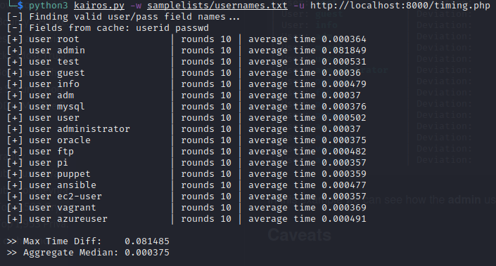

# Kairos
Kairos is a vulnerability assesment tool for the web based on [side-channel timing attacks](https://en.wikipedia.org/wiki/Side-channel_attack). This tool allows the researcher to find valid **user names** on a target web URL, given that the website login is flawed by design. 

## Usage
```bash
python3 kairos.py [-h] [-w WORDLIST] [-u URL] [-n ROUNDS] [-X HTTP_METHOD]
```

## How does it work?
This assessment tool relies on a structural flaw on the design of a login system in which the existence of a user is checked beforehand. In a vulnerable web, once a first call to check if a user exists is made to the backend, only then the system checks if the password matches and hashes the plain-text password submited by the user:

```php
<?php

// get user from DB based in POST param
$user = $db->query('SELECT * FROM users WHERE username="'.$_POST['userid'].'"');

// check user exists
if ($user) {
    ...
  // calculate password hash from POST
  $pass = hash_password($_POST['passwd']);
  // get user data
  $db_password = mysqli_fetch_row($user)['db_password'];
  
  // check if received password matches with one stored in the database
  if ($pass === $db_password) {
      // user login is valid
	...
  } else {
    // error: wrong password
    ...
  }
} else {
// error: user doesn't exist
...
}  
```

Therefore the **extra time** it takes for the backend system to compute the password hash allows us to determine if a user exists or not in the system independently of any log messages.

## Requirements
[Python3](https://www.python.org/downloads/) (version > 3.6 or more)

## See it in action

### Launch sample Request
```bash
python3 kairos.py -w samplelists/usernames.txt -u http://mysite.com/login
```

This repository includes a short wordlist of usernames for testing purposes (under *samplelists/* folder). For a more in-depth analysis please consider providing a more complete list of your choice as long as it follows the same format.

URL targets should be pages with standard login forms. Kairos will try to guess which **user** and **password** parameters are correct for as form input names and then it will craft the request based on these. If a correct **user/pass** combination is found, then the results are cached for that given URL domain and reused next time.

Kairos sends the request for a given **user/pass** multiple times (n=10 by default) and then calculates the [median](https://en.wikipedia.org/wiki/Median) of those values to avoid network connection issues generating ***outliars***. The value of rounds ***n*** can be set higher to gain more robust statistics on the results:

```bash
python3 kairos.py -w samplelists/usernames.txt -u http://mysite.com/login -n 50
```

Please consider that incrementing the factor ***n*** will be very noisy on the target network, so use with precaution.

### Understanding the results

After sucessful page requests have been made, a small report is shown as the output:



The data is divided in three columns, with number of requests made (rounds) and average time for these. At the bottom we can find additional values such as the **Maximum time difference** between the longest and shortest time spans and the **Median** of all requests.

We can optionally get a full report in which the most relevant values are highlighted in different colors:


In this example we can see how the **admin** user takes the longest time, highlighted as a found user.
## Caveats


## Disclaimer

For educational purposes only. The author(s) is not responsible for any misuse or damage caused by this tool to any user(s) or third parties.